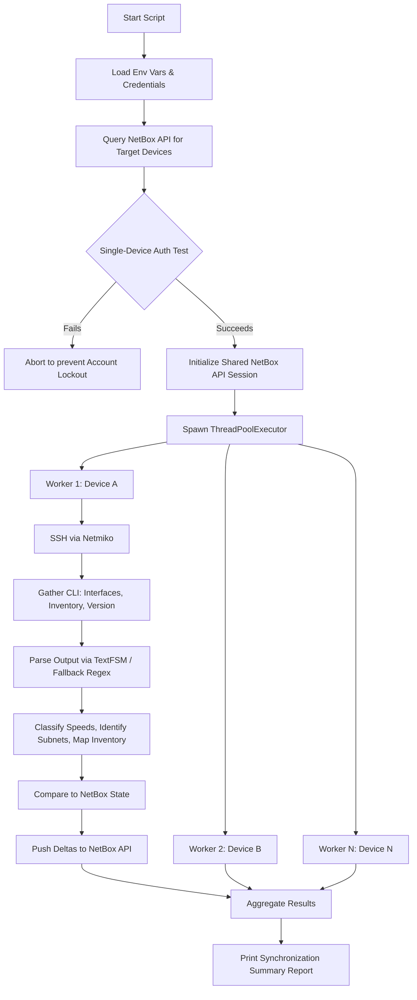

***

# Cisco IOS / NX-OS to NetBox Synchronizer

## 1. What This Script Does

This script is an automated discovery and synchronization tool that bridges the gap between your physical network and your NetBox instance. It connects to active Cisco IOS-XE and NX-OS devices defined in NetBox, scrapes their real-time operational state, and synchronizes that data back into NetBox. 

Specifically, it automates the following tasks:
*   **Device Serial Numbers:** Discovers and updates the chassis serial number.
*   **Physical Hardware Inventory:** Discovers modules, line cards, and transceivers (SFPs, QSFPs) and populates them into the NetBox Device Inventory.
*   **Interface Management:** Discovers physical interfaces, subinterfaces, and virtual interfaces (Loopbacks, SVIs/VLANs, Port-Channels). Creates missing interfaces or updates existing ones.
*   **Interface Enrichment:** Updates interface descriptions, MTU sizes, administrative status, and calculates the correct NetBox physical interface type (e.g., `10gbase-x-sfpp`, `1000base-t`) based on real-time operational speeds and naming heuristics.
*   **IP Address Management (IPAM):** Discovers assigned IP addresses, infers the correct subnet mask by querying parent prefixes in NetBox, creates the IP if it doesn't exist, and binds it to the correct interface.

## 2. How It Works

The script operates using a concurrent, thread-safe architecture designed for speed and reliability:

1.  **Device Targeting:** It connects to the NetBox API and pulls a list of `Active` devices. It filters out unsupported platforms (like ACI/APIC) and applies any user-defined filters (Site, Role, Tag).
2.  **Safety Check:** It performs a defensive SSH authentication check against a single device first. If this fails, the script halts to prevent locking out your TACACS/RADIUS service account across multiple simultaneous threads.
3.  **Concurrent Polling (Netmiko):** It spawns a Thread Pool to process multiple devices simultaneously. For each device, it establishes an SSH session using `Netmiko` and executes operational commands (`show ip interface brief`, `show interfaces`, `show inventory`, `show version`).
4.  **Parsing (TextFSM & Fallbacks):** It attempts to parse the CLI output into structured data using `TextFSM` templates. If TextFSM fails or is missing, it falls back to custom, highly robust Regex/raw-text parsers.
5.  **Reconciliation & Sync:** It compares the discovered state against the current NetBox state using a shared, session-optimized NetBox API client. It calculates the necessary delta and pushes updates to NetBox.

### Architecture Workflow Diagram



## 3. Dependencies

To run this script, you need Python 3.8+ and the following packages. 

**Python Packages:**
```bash
pip install pynetbox netmiko requests
```

**TextFSM Templates (Crucial):**
Netmiko relies on `ntc-templates` to parse raw CLI output into structured dictionaries. Ensure you have the templates installed and the environment variable set so Netmiko can find them:
```bash
# Install the templates
git clone https://github.com/networktocode/ntc-templates.git ~/ntc-templates

# Set the environment variable (add this to your ~/.bashrc or ~/.zshrc)
export NET_TEXTFSM=~/ntc-templates/ntc_templates/templates
```

## 4. Modifying and Tuning for Your Environment

This script is designed to be highly portable. You do not need to run it on the NetBox server itself; it can be run from any workstation or CI/CD runner that has HTTPS access to NetBox and SSH access to the switches.

### Configuration via Environment Variables
Set these environment variables to tune the script to your remote environment:

*   **`NETBOX_URL`**: Change this from the default local address to your production NetBox URL (e.g., `export NETBOX_URL="https://netbox.yourcompany.com"`).
*   **`NETBOX_VERIFY_SSL`**: Set to `"true"` if your NetBox uses a valid, trusted SSL certificate. Set to `"false"` if you are using self-signed certs.
*   **`DRY_RUN`**: **Highly Recommended for first runs.** Set to `"true"` (`export DRY_RUN="true"`). The script will run entirely, scrape the devices, and log exactly what it *would* do to NetBox without actually writing any changes.

### Targeting Specific Devices
If you don't want to sync your entire network at once, you can target specific subsets using environment variables or by answering the interactive prompts at runtime:
*   `NETBOX_SITE`: Filter by site slug (e.g., `hq-datacenter`)
*   `NETBOX_ROLE`: Filter by role slug (e.g., `core-switch`, `access-switch`)
*   `NETBOX_TAG`: Filter by a specific tag
*   `NETBOX_DEVICE`: Target a single specific device by name.

### Tuning Concurrency & Performance
*   **`MAX_WORKERS`**: By default, the script calculates the number of CPU cores and scales up to 15 concurrent threads. If your SSH jump server or NetBox instance is being overwhelmed, lower this variable directly in the script (e.g., `MAX_WORKERS = 5`).
*   **`SSH_TIMEOUT` & `SSH_RETRIES`**: If you have high-latency links or slow-to-respond devices, increase `SSH_TIMEOUT` (default is 30s) or `global_delay_factor` inside the `get_driver()` function to give the devices more time to return command output.

### Platform Adjustments
If you have devices you want the script to explicitly ignore, add their NetBox platform or device-type slugs to the exclusion lists at the top of the script:
```python
EXCLUDED_PLATFORMS = ["aci", "apic", "cisco-wlc"]
EXCLUDED_DEVICE_TYPES = ["cisco-asa-5520"]
```
